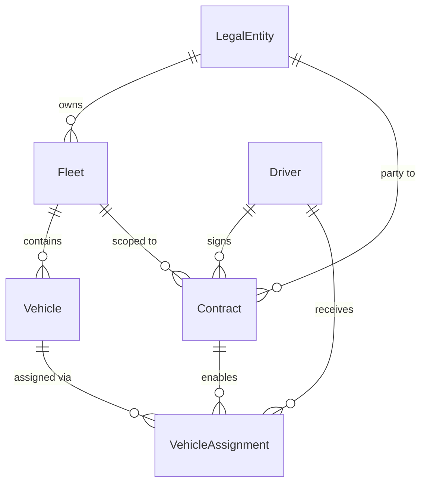

# Fleet Management Domain Redesign

## Domain Model




Six domain entities in `internal/core/domain/`:

- **LegalEntity** -- `ID`, `Name`, `INN` (tax ID)
- **Fleet** -- `ID`, `LegalEntityID`, `Name`
- **Vehicle** -- `ID`, `FleetID`, `Make`, `Model`, `Year`, `LicensePlate`
- **Driver** -- `ID`, `FirstName`, `LastName`, `LicenseNumber`
- **Contract** -- `ID`, `DriverID`, `LegalEntityID`, `FleetID`, `StartDate`, `EndDate`, `TerminatedAt *time.Time`, `TerminatedBy string`
- **VehicleAssignment** -- `ID`, `DriverID`, `VehicleID`, `ContractID`, `StartTime`, `EndTime *time.Time`

### Business Rules (enforced in services)

1. Contract overlap: For the same `(driverID, legalEntityID, fleetID)` tuple, contract date ranges must not intersect. A terminated contract's effective end is `min(EndDate, TerminatedAt)`.
2. Vehicle assignment requires an active contract for the fleet the vehicle belongs to.
3. Only one active assignment per driver per fleet at a time (EndTime == nil means active).
4. Multiple drivers may be assigned to the same vehicle simultaneously.

### Domain Errors ([errors.go](internal/core/domain/errors.go))

Extend with: `ErrNotFound`, `ErrInvalidInput`, `ErrConflict` (for overlap/duplicate violations), `ErrContractNotActive`, `ErrVehicleAlreadyAssigned`.

## REST API Endpoints


| Resource          | Method | Path                                     | Description                   |
| ----------------- | ------ | ---------------------------------------- | ----------------------------- |
| LegalEntity       | POST   | `/legal-entities`                        | Create                        |
|                   | GET    | `/legal-entities`                        | List all                      |
|                   | GET    | `/legal-entities/{id}`                   | Get by ID                     |
|                   | DELETE | `/legal-entities/{id}`                   | Delete                        |
| Fleet             | POST   | `/legal-entities/{legalEntityId}/fleets` | Create fleet for legal entity |
|                   | GET    | `/legal-entities/{legalEntityId}/fleets` | List fleets for legal entity  |
|                   | GET    | `/fleets/{id}`                           | Get by ID                     |
|                   | DELETE | `/fleets/{id}`                           | Delete                        |
| Vehicle           | POST   | `/fleets/{fleetId}/vehicles`             | Create vehicle in fleet       |
|                   | GET    | `/fleets/{fleetId}/vehicles`             | List vehicles in fleet        |
|                   | GET    | `/vehicles/{id}`                         | Get by ID                     |
|                   | DELETE | `/vehicles/{id}`                         | Delete                        |
| Driver            | POST   | `/drivers`                               | Create                        |
|                   | GET    | `/drivers`                               | List all                      |
|                   | GET    | `/drivers/{id}`                          | Get by ID                     |
|                   | DELETE | `/drivers/{id}`                          | Delete                        |
| Contract          | POST   | `/drivers/{driverId}/contracts`          | Create contract               |
|                   | GET    | `/drivers/{driverId}/contracts`          | List driver's contracts       |
|                   | GET    | `/contracts/{id}`                        | Get by ID                     |
|                   | POST   | `/contracts/{id}/terminate`              | Terminate contract            |
| VehicleAssignment | POST   | `/contracts/{contractId}/assignments`    | Assign vehicle                |
|                   | GET    | `/contracts/{contractId}/assignments`    | List assignments              |
|                   | POST   | `/assignments/{id}/return`               | Return vehicle                |


## Architecture Changes

### FX Group Pattern for Multiple Handlers

The current code binds a single `RouteRegistrar`. The new design uses `**fx.Group`** to collect multiple handlers -- a valuable pattern to demonstrate in the example.

[server.go](internal/adapters/in/http/server.go) changes from:

```go
func NewServer(cfg *config.HTTPServerConfig, handler RouteRegistrar) *http.Server
```

to:

```go
func NewServer(cfg *config.HTTPServerConfig, handlers []RouteRegistrar) *http.Server
```

Each handler is provided with `fx.ResultTags(`group:"routes"`)` and the server receives them with `fx.ParamTags(``,` group:"routes"`)`.

### File Structure

**Delete** all Foo-related files:

- `internal/core/domain/entity_foo.go`
- `internal/core/services/fooservice/` (entire directory)
- `internal/adapters/in/http/handler.go`, `handler_test.go`, `handler_internal_test.go`
- `internal/adapters/out/repository/memory.go`, `memory_test.go`
- `internal/core/ports/mocks/` (will be regenerated)

**Domain** -- one file per entity in `internal/core/domain/`:

- `legal_entity.go`, `fleet.go`, `vehicle.go`, `driver.go`, `contract.go`, `vehicle_assignment.go`, `errors.go`

**Ports** -- `internal/core/ports/`:

- `repositories.go` -- 6 repository interfaces (LegalEntity, Fleet, Vehicle, Driver, Contract, VehicleAssignment)
- `services.go` -- 6 service interfaces matching the API operations

**Services** -- one subpackage per service in `internal/core/services/`:

- `legalentity/`, `fleet/`, `vehicle/`, `driver/` -- straightforward CRUD with validation
- `contract/` -- CRUD + overlap detection + termination logic
- `assignment/` -- assign/return with active-contract check and one-vehicle-per-driver-per-fleet check
- `fx.go` -- updated module wiring all 6 services with `fx.As` bindings

**HTTP Handlers** -- one file per resource in `internal/adapters/in/http/`:

- `handler_legal_entity.go`, `handler_fleet.go`, `handler_vehicle.go`, `handler_driver.go`, `handler_contract.go`, `handler_assignment.go`
- `common.go` -- shared `respondJSON`, `decodeJSON`, error mapping helpers
- `server.go` -- updated to accept `[]RouteRegistrar`
- `fx.go` -- uses `fx.Group` to register all 6 handlers

**Repositories** -- one file per entity in `internal/adapters/out/repository/`:

- `memory_legal_entity.go`, `memory_fleet.go`, `memory_vehicle.go`, `memory_driver.go`, `memory_contract.go`, `memory_assignment.go`
- `fx.go` -- provides all 6 repositories

**Tests** -- full coverage for all layers:

- Service tests with gomock-generated mocks
- Handler tests with mock services
- Repository tests for in-memory implementations
- `cmd/server/main_test.go` -- FX wiring test

**Other updates**:

- `CLAUDE.md` -- updated API docs and architecture description

