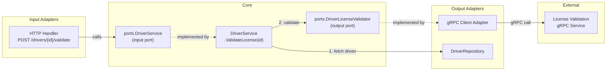

# gRPC Driver License Validation

## Architecture




## 1. Protobuf Definition

Create `proto/driverlicense/v1/driverlicense.proto`:

```protobuf
syntax = "proto3";
package driverlicense.v1;
option go_package = "github.com/albenik/uber-fx-based-service-example/gen/driverlicense/v1;driverlicensev1";

service DriverLicenseValidationService {
  rpc ValidateLicense(ValidateLicenseRequest) returns (ValidateLicenseResponse);
}

message ValidateLicenseRequest {
  string first_name = 1;
  string last_name = 2;
  string license_number = 3;
}

message ValidateLicenseResponse {
  ValidationResult result = 1;
}

enum ValidationResult {
  VALIDATION_RESULT_UNSPECIFIED = 0;
  VALIDATION_RESULT_OK = 1;
  VALIDATION_RESULT_NOT_FOUND = 2;
  VALIDATION_RESULT_DATA_MISMATCH = 3;
}
```

Code generation via `buf` (add `buf.yaml` + `buf.gen.yaml` at project root). Generated Go stubs go to `gen/driverlicense/v1/`. Add `protoc-gen-go` and `protoc-gen-go-grpc` to the `tool` block in `go.mod`. Add a `proto-generate` Makefile target.

## 2. Domain Layer

New file: `[internal/core/domain/license_validation.go](internal/core/domain/license_validation.go)`

```go
type LicenseValidationResult string

const (
    LicenseValid        LicenseValidationResult = "ok"
    LicenseNotFound     LicenseValidationResult = "not_found"
    LicenseDataMismatch LicenseValidationResult = "data_mismatch"
)
```

## 3. Ports (Interfaces)

**New output port** -- `[internal/core/ports/validators.go](internal/core/ports/validators.go)`:

```go
type DriverLicenseValidator interface {
    ValidateLicense(ctx context.Context, firstName, lastName, licenseNumber string) (domain.LicenseValidationResult, error)
}
```

With its own `//go:generate mockgen` directive.

**Update input port** -- add `ValidateLicense` to `DriverService` in `[internal/core/ports/services.go](internal/core/ports/services.go)`:

```go
type DriverService interface {
    // ... existing methods ...
    ValidateLicense(ctx context.Context, id string) (domain.LicenseValidationResult, error)
}
```

## 4. gRPC Client Adapter (Output Adapter)

New directory: `internal/adapters/out/grpc/driverlicense/`

- `[client.go](internal/adapters/out/grpc/driverlicense/client.go)` -- Implements `ports.DriverLicenseValidator`. Holds a `driverlicensev1.DriverLicenseValidationServiceClient` gRPC stub. Constructor takes `*grpc.ClientConn` and `*zap.Logger`. Maps proto `ValidationResult` enum to `domain.LicenseValidationResult`.
- `[fx.go](internal/adapters/out/grpc/driverlicense/fx.go)` -- FX module that creates a `*grpc.ClientConn` (with lifecycle close hook) from config and provides the client as `ports.DriverLicenseValidator`.

Top-level module: `[internal/adapters/out/grpc/fx.go](internal/adapters/out/grpc/fx.go)` -- Composes sub-modules (currently just `driverlicense.Module()`). Imported in `main.go` as `grpcAdapter`.

## 5. Configuration

New file: `[internal/config/grpc.go](internal/config/grpc.go)`:

```go
type DriverLicenseGRPCConfig struct {
    Addr string
}
```

Modify `[internal/config/config.go](internal/config/config.go)`:

- Add `DriverLicenseGRPC *DriverLicenseGRPCConfig` field to `Config`
- Read from `DRIVER_LICENSE_GRPC_ADDR` env var

Modify `[internal/config/fx.go](internal/config/fx.go)`:

- Add `*DriverLicenseGRPCConfig` to `splitConfig` return values

## 6. Driver Service Update

Modify `[internal/core/services/driver/service.go](internal/core/services/driver/service.go)`:

- Add `validator ports.DriverLicenseValidator` field to `Service` struct
- Update `New()` constructor to accept the validator
- Implement `ValidateLicense(ctx, id)`: fetch driver by ID via repo, call `validator.ValidateLicense(ctx, driver.FirstName, driver.LastName, driver.LicenseNumber)`, return result

## 7. HTTP Handler Update

Modify `[internal/adapters/in/http/handler_driver.go](internal/adapters/in/http/handler_driver.go)`:

- Add route `r.Post("/{id}/validate", h.validateLicense)` inside the existing `/drivers` route group
- Implement `validateLicense` handler: extract `id` from URL, call `h.svc.ValidateLicense(ctx, id)`, respond with JSON:

```json
{"driver_id": "...", "result": "ok"}
```

## 8. FX Wiring

Modify `[cmd/server/main.go](cmd/server/main.go)` -- add gRPC adapter module:

```go
import grpcAdapter "github.com/albenik/uber-fx-based-service-example/internal/adapters/out/grpc"

func AppModules() []fx.Option {
    return []fx.Option{
        telemetry.Module(),
        config.Module(),
        postgres.Module(),
        grpcAdapter.Module(),  // new
        services.Module(),
        httpAdapter.Module(),
    }
}
```

No changes needed to `[internal/core/services/fx.go](internal/core/services/fx.go)` or `[internal/adapters/in/http/fx.go](internal/adapters/in/http/fx.go)` -- FX auto-resolves the new `ports.DriverLicenseValidator` dependency for `driver.New()` and the updated `ports.DriverService` for `NewDriverHandler`.

## 9. Dependencies and Tooling

- Add `google.golang.org/grpc` and `google.golang.org/protobuf` as **direct** dependencies in `go.mod` (currently indirect via goose)
- Add `protoc-gen-go` and `protoc-gen-go-grpc` to the `tool` block
- Add `buf.yaml` and `buf.gen.yaml` for proto code generation
- Add `proto-generate` target to `Makefile`
- Regenerate mocks: `go generate ./internal/core/ports/...`

## New Files Summary


| File                                                 | Purpose                       |
| ---------------------------------------------------- | ----------------------------- |
| `proto/driverlicense/v1/driverlicense.proto`         | Protobuf service definition   |
| `buf.yaml`                                           | Buf module config             |
| `buf.gen.yaml`                                       | Buf code generation config    |
| `gen/driverlicense/v1/*.pb.go`                       | Generated Go stubs (2 files)  |
| `internal/core/domain/license_validation.go`         | Domain validation result type |
| `internal/core/ports/validators.go`                  | Output port interface         |
| `internal/adapters/out/grpc/fx.go`                   | Top-level gRPC adapter module |
| `internal/adapters/out/grpc/driverlicense/client.go` | gRPC client implementation    |
| `internal/adapters/out/grpc/driverlicense/fx.go`     | FX sub-module                 |
| `internal/config/grpc.go`                            | gRPC config struct            |


## Modified Files Summary

- `internal/core/ports/services.go` -- add `ValidateLicense` to `DriverService`
- `internal/core/services/driver/service.go` -- add validator dep + method
- `internal/adapters/in/http/handler_driver.go` -- add validate endpoint
- `internal/config/config.go` -- add gRPC config field + env var
- `internal/config/fx.go` -- split gRPC config
- `cmd/server/main.go` -- add gRPC adapter module
- `go.mod` -- promote gRPC/protobuf to direct deps, add tools
- `Makefile` -- add proto-generate target

