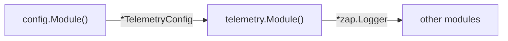
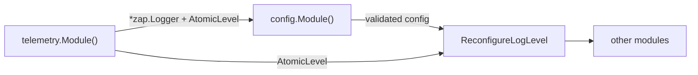

# Restructure Logger Initialization Sequence

## Current Flow




`NewLogger` depends on `*config.TelemetryConfig`, so config must resolve first. Logger format (dev/prod) is driven by `LOG_DEV` env var via config.

## New Flow




1. Logger created at DEBUG with no config dependency; `DEVLOG` env var checked directly
2. Config loaded, validated via `fx.Invoke` (uses logger to report errors, returns error to stop app)
3. `ReconfigureLogLevel` invoked to set log level from `TelemetryConfig.LogLevel`

## File Changes

### 1. [internal/config/telemetry.go](internal/config/telemetry.go)

Replace `Development bool` with `LogLevel string`.

### 2. [internal/config/config.go](internal/config/config.go)

- Remove `LOG_DEV` env reading
- Add `LOG_LEVEL` env reading (default `"debug"`)
- Add `Validate(logger *zap.Logger) error` method that:
  - Checks `LOG_LEVEL` is a valid zap level (`zapcore.Level.UnmarshalText`)
  - Checks `DATABASE_MASTER_URL` is non-empty
  - Logs each error individually via `logger.Error(...)` 
  - Returns aggregated error if any validations failed

### 3. [internal/config/fx.go](internal/config/fx.go)

Add `fx.Invoke((*Config).Validate)` after providers. FX will inject `*zap.Logger` into it since `telemetry.Module()` is listed before `config.Module()` in main.

### 4. [internal/telemetry/logging.go](internal/telemetry/logging.go)

- Remove `config` import and `*config.TelemetryConfig` parameter
- `NewLogger() (*zap.Logger, zap.AtomicLevel, error)`:
  - Create `zap.NewAtomicLevelAt(zap.DebugLevel)`
  - Check `os.Getenv("DEVLOG")` directly; use `zap.NewDevelopmentConfig()` if truthy, else `zap.NewProductionConfig()`
  - Set `cfg.Level = level`, build logger, return `(logger, level, err)`
- Add `ReconfigureLogLevel(level zap.AtomicLevel, cfg *config.TelemetryConfig) error`:
  - Parse `cfg.LogLevel` via `zapcore.Level.UnmarshalText`
  - Call `level.SetLevel(parsed)`

### 5. [internal/telemetry/fx.go](internal/telemetry/fx.go)

No changes needed -- `fx.Provide(NewLogger)` still works since FX auto-provides both `*zap.Logger` and `zap.AtomicLevel` from the multi-return.

### 6. [cmd/server/main.go](cmd/server/main.go)

Add `fx.Invoke(telemetry.ReconfigureLogLevel)` after `config.Module()` to ensure level reconfiguration runs after validation:

```go
func AppModules() []fx.Option {
    return []fx.Option{
        telemetry.Module(),
        config.Module(),
        fx.Invoke(telemetry.ReconfigureLogLevel),
        postgres.Module(),
        grpcAdapter.Module(),
        services.Module(),
        httpAdapter.Module(),
    }
}
```

### 7. Update tests

- [internal/telemetry/logging_test.go](internal/telemetry/logging_test.go) -- `NewLogger` no longer takes config; test dev mode via `t.Setenv("DEVLOG", "true")`; add tests for `ReconfigureLogLevel`
- [internal/config/config_test.go](internal/config/config_test.go) -- remove `LOG_DEV` tests, add `LOG_LEVEL` tests, add `Validate` tests
- [internal/config/telemetry.go](internal/config/telemetry.go) -- trivial struct change

### 8. Update CLAUDE.md

- Replace `LOG_DEV` with `LOG_LEVEL` and `DEVLOG` in the environment variables table
- Update `TelemetryConfig` in the Domain Model section

