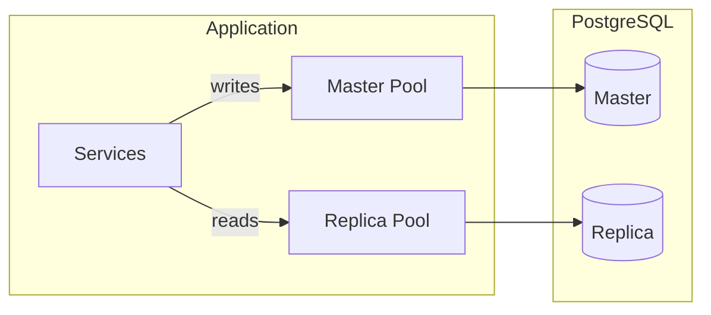

# PostgreSQL Storage Migration

## Architecture Overview




Each repository receives a `*DB` struct containing both `master` and `replica` `*pgxpool.Pool`. Write operations (`Save`, `SoftDelete`, `Undelete`) use the master pool; read operations (`FindByID`, `FindAll`, etc.) use the replica pool. If `DATABASE_REPLICA_URL` is empty, the master pool is used for both.

## 1. New Dependencies

Add to `go.mod`:

- `github.com/jackc/pgx/v5` -- PostgreSQL driver + connection pool
- `github.com/pressly/goose/v3` -- SQL migrations

## 2. Database Migrations

Create `migrations/` directory at project root with sequential goose SQL files.

`**migrations/00001_create_legal_entities.sql**`

```sql
-- +goose Up
CREATE TABLE legal_entities (
    id         UUID PRIMARY KEY,
    name       TEXT NOT NULL,
    tax_id     TEXT NOT NULL,
    deleted_at TIMESTAMPTZ
);

-- +goose Down
DROP TABLE legal_entities;
```

`**migrations/00002_create_fleets.sql**`

```sql
-- +goose Up
CREATE TABLE fleets (
    id              UUID PRIMARY KEY,
    legal_entity_id UUID NOT NULL REFERENCES legal_entities(id),
    name            TEXT NOT NULL,
    deleted_at      TIMESTAMPTZ
);
CREATE INDEX idx_fleets_legal_entity_id ON fleets(legal_entity_id);

-- +goose Down
DROP TABLE fleets;
```

`**migrations/00003_create_vehicles.sql**`

```sql
-- +goose Up
CREATE TABLE vehicles (
    id            UUID PRIMARY KEY,
    fleet_id      UUID NOT NULL REFERENCES fleets(id),
    make          TEXT NOT NULL,
    model         TEXT NOT NULL,
    year          INTEGER NOT NULL,
    license_plate TEXT NOT NULL,
    deleted_at    TIMESTAMPTZ
);
CREATE INDEX idx_vehicles_fleet_id ON vehicles(fleet_id);

-- +goose Down
DROP TABLE vehicles;
```

`**migrations/00004_create_drivers.sql**`

```sql
-- +goose Up
CREATE TABLE drivers (
    id             UUID PRIMARY KEY,
    first_name     TEXT NOT NULL,
    last_name      TEXT NOT NULL,
    license_number TEXT NOT NULL,
    deleted_at     TIMESTAMPTZ
);

-- +goose Down
DROP TABLE drivers;
```

`**migrations/00005_create_contracts.sql**`

```sql
-- +goose Up
CREATE TABLE contracts (
    id              UUID PRIMARY KEY,
    driver_id       UUID NOT NULL REFERENCES drivers(id),
    legal_entity_id UUID NOT NULL REFERENCES legal_entities(id),
    fleet_id        UUID NOT NULL REFERENCES fleets(id),
    start_date      DATE NOT NULL,
    end_date        DATE NOT NULL,
    terminated_at   TIMESTAMPTZ,
    terminated_by   TEXT NOT NULL DEFAULT '',
    deleted_at      TIMESTAMPTZ
);
CREATE INDEX idx_contracts_driver_id ON contracts(driver_id);
CREATE INDEX idx_contracts_overlap ON contracts(driver_id, legal_entity_id, fleet_id);

-- +goose Down
DROP TABLE contracts;
```

`**migrations/00006_create_vehicle_assignments.sql**`

```sql
-- +goose Up
CREATE TABLE vehicle_assignments (
    id          UUID PRIMARY KEY,
    driver_id   UUID NOT NULL REFERENCES drivers(id),
    vehicle_id  UUID NOT NULL REFERENCES vehicles(id),
    contract_id UUID NOT NULL REFERENCES contracts(id),
    start_time  TIMESTAMPTZ NOT NULL,
    end_time    TIMESTAMPTZ,
    deleted_at  TIMESTAMPTZ
);
CREATE INDEX idx_vehicle_assignments_contract_id ON vehicle_assignments(contract_id);
CREATE INDEX idx_vehicle_assignments_driver_id ON vehicle_assignments(driver_id);

-- +goose Down
DROP TABLE vehicle_assignments;
```

## 3. Configuration Changes

Update [internal/config/config.go](internal/config/config.go):

- Add `DatabaseConfig` struct with `MasterURL string` and `ReplicaURL string`
- Load from env vars `DATABASE_MASTER_URL` and `DATABASE_REPLICA_URL`
- Add `Database *DatabaseConfig` to `Config`
- Update `splitConfig` in [internal/config/fx.go](internal/config/fx.go) to return `*DatabaseConfig`

## 4. New Package: `internal/adapters/out/postgres/`

Replace [internal/adapters/out/repository/](internal/adapters/out/repository/) with a new `postgres` package. The old `repository` package will be deleted.

### File structure:

```
internal/adapters/out/postgres/
    db.go              -- DB struct (master + replica pgxpool.Pool), constructor, Close
    migrate.go         -- Goose migration runner (embedded SQL files)
    fx.go              -- FX module: pools, migration, repository providers
    legal_entity.go    -- LegalEntityRepository
    fleet.go           -- FleetRepository
    vehicle.go         -- VehicleRepository
    driver.go          -- DriverRepository
    contract.go        -- ContractRepository
    assignment.go      -- VehicleAssignmentRepository
```

### `db.go` -- Connection management

```go
type DB struct {
    master  *pgxpool.Pool
    replica *pgxpool.Pool
}

func NewDB(ctx context.Context, cfg *config.DatabaseConfig) (*DB, error) {
    master, err := pgxpool.New(ctx, cfg.MasterURL)
    // ...
    replica := master
    if cfg.ReplicaURL != "" {
        replica, err = pgxpool.New(ctx, cfg.ReplicaURL)
    }
    return &DB{master: master, replica: replica}, nil
}

func (db *DB) Master() *pgxpool.Pool { return db.master }
func (db *DB) Replica() *pgxpool.Pool { return db.replica }
func (db *DB) Close() { /* close both pools */ }
```

### `migrate.go` -- Embedded migrations

Use `embed.FS` to embed `migrations/*.sql` from project root and run goose on startup. Goose requires `database/sql` for its provider, so we open a short-lived `*sql.DB` via pgx stdlib adapter for migration only.

### `fx.go` -- Module wiring

```go
func Module() fx.Option {
    return fx.Module("postgres",
        fx.Provide(NewDB),
        fx.Provide(
            fx.Annotate(NewLegalEntityRepository, fx.As(new(ports.LegalEntityRepository))),
            fx.Annotate(NewFleetRepository, fx.As(new(ports.FleetRepository))),
            // ... etc for all 6 repositories
        ),
        fx.Invoke(RunMigrations),  // runs goose Up on startup
        fx.Invoke(registerCloseHook), // closes pools on shutdown
    )
}
```

### Repository pattern (plain SQL)

Each repository struct holds a `*DB` reference and uses:

- `db.Master().Exec(ctx, sql, args...)` for writes
- `db.Replica().Query(ctx, sql, args...)` / `QueryRow` for reads
- Manual `pgx.Rows` scanning into `domain.*` structs

Example for `LegalEntityRepository.FindByID`:

```go
func (r *LegalEntityRepository) FindByID(ctx context.Context, id string) (*domain.LegalEntity, error) {
    row := r.db.Replica().QueryRow(ctx,
        `SELECT id, name, tax_id, deleted_at FROM legal_entities WHERE id = $1 AND deleted_at IS NULL`, id)
    var e domain.LegalEntity
    if err := row.Scan(&e.ID, &e.Name, &e.TaxID, &e.DeletedAt); err != nil {
        if errors.Is(err, pgx.ErrNoRows) {
            return nil, domain.ErrNotFound
        }
        return nil, err
    }
    return &e, nil
}
```

### Mapping pgx errors to domain errors

- `pgx.ErrNoRows` -> `domain.ErrNotFound`
- `SoftDelete` checks rows affected: 0 rows = `ErrNotFound`; if already soft-deleted = `ErrAlreadyDeleted` (query with `deleted_at IS NULL` condition)

### `FindOverlapping` (contracts)

Implemented as a single SQL query using date-range overlap logic:

```sql
SELECT ... FROM contracts
WHERE driver_id = $1 AND legal_entity_id = $2 AND fleet_id = $3
  AND id != $6 AND deleted_at IS NULL
  AND $4 < COALESCE(terminated_at, end_date)
  AND $5 > start_date
```

### `FindActiveByDriverIDAndFleetID` (assignments)

Join `vehicle_assignments` with `vehicles` to resolve fleet:

```sql
SELECT va.* FROM vehicle_assignments va
JOIN vehicles v ON v.id = va.vehicle_id
WHERE va.driver_id = $1 AND v.fleet_id = $2
  AND va.end_time IS NULL AND va.deleted_at IS NULL
LIMIT 1
```

## 5. Update Bootstrap

- [cmd/server/main.go](cmd/server/main.go): replace `repository.Module()` import with `postgres.Module()`
- Delete the old `internal/adapters/out/repository/` package entirely

## 6. Update CLAUDE.md

Update build/run commands and architecture notes to reflect PostgreSQL dependency and new package structure.